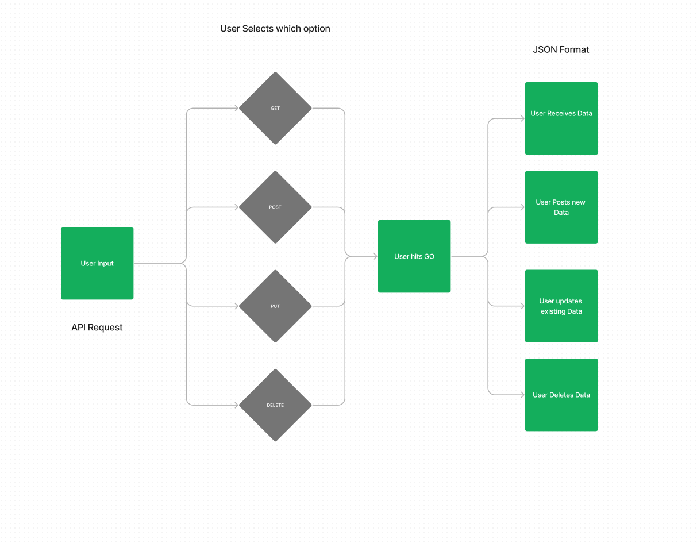

# LAB - 28

RESTy Phase 3: Connect RESTy with APIs, running live requests.

Author: Jonathan Brooks

[Pull Request](https://github.com/jonbrooks01/resty/pull/5)

<!-- [deployed server](https://basic-server-4efy.onrender.com) -->

## Setup

.env requirements: NA

PORT - 5173

## Running the app

 npm run dev

Endpoint: Returns Object

<!-- {
  "domain": "deployment-practice-main.onrender.com/",
  "status": "{name: name}",
 "port":
} -->
Tests
Unit Tests: npm run test
<!-- Lint Tests: npm run lint -->

## UML

